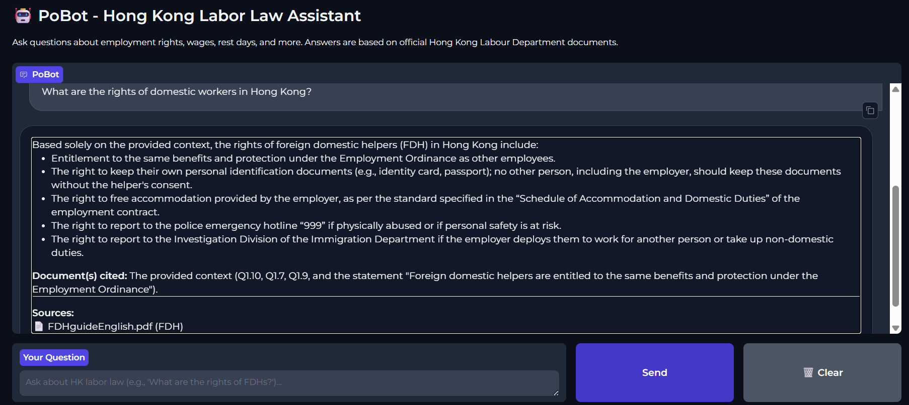

# PoBot - HK Labor Law Chatbot

## Demo



## Quick Start

### 1. Setup Environment
```bash
git clone https://github.com/harsh-vpatel/PoBot.git
source PoBot_env/bin/activate  # Windows: PoBot_env\Scripts\activate
pip install -r requirements.txt
```

### 2. Run Preprocessing (optional - chunks available in data/processed)
```bash
cd src
python preprocess.py
```

### 3. Build Vectorstore (required)
```bash
python embedding_setup.py
```

### 4. Launch PoBot UI
```bash
python chatbot_ui.py
```
Then open **http://localhost:7860** in your browser.

---

## Alternative: Command Line Mode
```bash
python rag_pipeline.py
```
Then type questions directly in the terminal.

---

## Run Evaluation

```bash
python evaluate_using_deepeval.py
```
Using DeepEval avoids OpenAI country implementation issues as RAGAS requires an OPENAI_API_KEY

Generates detailed JSON report with 5 metrics:
- Faithfulness (hallucination detection)
- Answer Relevancy
- Context Precision
- Context Recall
- Answer Correctness

---

## Recent Fixes (2026-04-22)

### 1. Fixed RAG Pipeline Prompt
- Changed overly conservative NULL response rule
- Now returns partial information instead of "don't know"
- Fixes minimum wage question issue

### 2. Fixed Context Precision Metric
- Now uses source_documents metadata instead of text search
- Was returning 0.0 for all questions (bug)
- Now correctly measures retrieval ranking quality

### 3. Added Chatbot UI
- Simple Gradio web interface
- Sample questions for quick testing
- Shows sources for each answer
- Clean, modern design

---

## Expected Performance

After fixes, target metrics:
- **Overall Score:** 0.75+ (was 0.63)
- **Faithfulness:** 0.85+ (low hallucination)
- **Answer Correctness:** 0.75+ (was 0.62)
- **Source Recall:** 75%+ (good retrieval)

---

## API Configuration

DeepSeek API is configured in:
- `rag_pipeline.py` line 11: `DEEPSEEK_API_KEY`
- `evaluate_using_deepeval.py` line 13: `DEEPSEEK_API_KEY`

Set your key accordingly

---

## Troubleshooting

### "Vectorstore not found"
→ Run `embedding_setup.py` first

### "API key error"
→ Check DeepSeek API key in rag_pipeline.py

### "Gradio not installed"
→ Run `pip install gradio`

### Low evaluation scores
→ Check chunk sizes in preprocess.py (try 1000-1500 chars)
→ Verify source documents contain expected information
